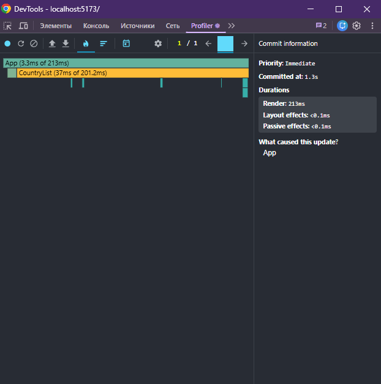
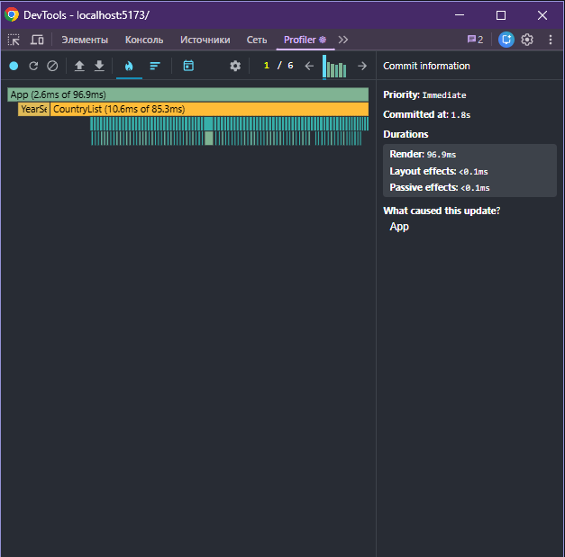
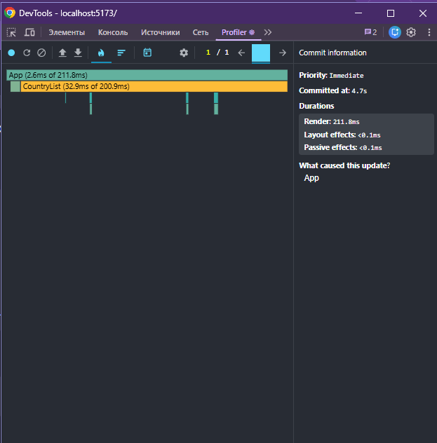
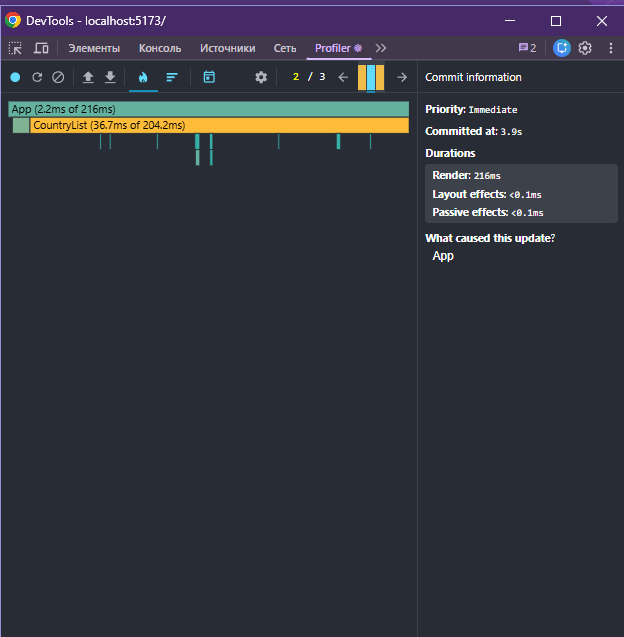
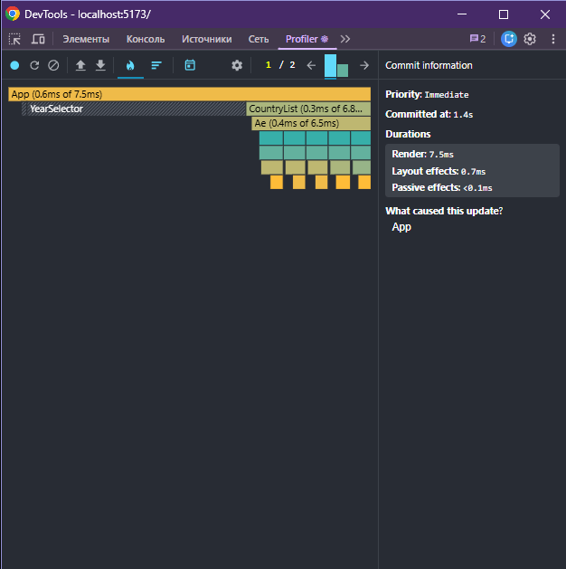
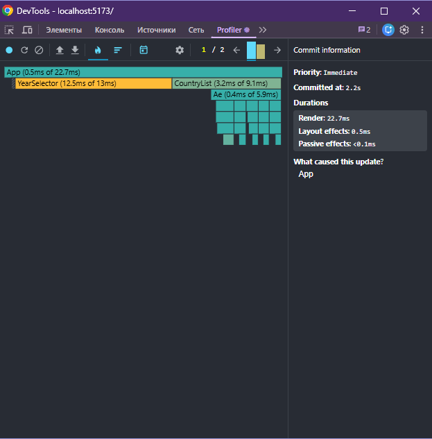
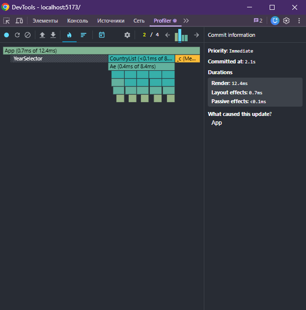

# Performance Optimization Report

## Baseline Measurements

### Interaction A: Sort countries

- **Commit duration**: ~0.213 s
- **Render duration**: 213 ms
- **Screenshot**: 

### Interaction B: Search countries

- **Commit duration**: ~0.097 s
- **Render duration**: 96.9 ms
- **Screenshot**: 

### Interaction C: Change year

- **Commit duration**: ~0.212 s
- **Render duration**: 211.8 ms
- **Screenshot**: 

### Interaction D: Toggle column

- **Commit duration**: ~0.216 s
- **Render duration**: 216 ms
- **Screenshot**: 

## Optimized Measurements

### Interaction A: Sort countries

- **Commit duration**: ~0.008 s
- **Render duration**: 7.5 ms
- **Screenshot**: 

### Interaction B: Search countries

- **Commit duration**: ~0.007 s
- **Render duration**: 7 ms
- **Screenshot**: 

### Interaction C: Change year

- **Commit duration**: 0.023 s
- **Render duration**: 22.7 ms
- **Screenshot**: 

### Interaction D: Toggle column

- **Commit duration**: 0.012 s
- **Render duration**: 12.4 ms
- **Screenshot**: 

## Summary of Improvements

| Interaction      | Baseline (ms) | Optimized (ms) | Improvement |
| ---------------- | ------------- | -------------- | ----------- |
| Sort countries   | 213           | 7.5            | 96.5%       |
| Search countries | 96.9          | 7              | 92.8%       |
| Change year      | 211.8         | 22.7           | 89.3%       |
| Toggle column    | 216           | 12.4           | 94.3%       |
| **Average**      | **184.4**     | **12.4**       | **93.3%**   |